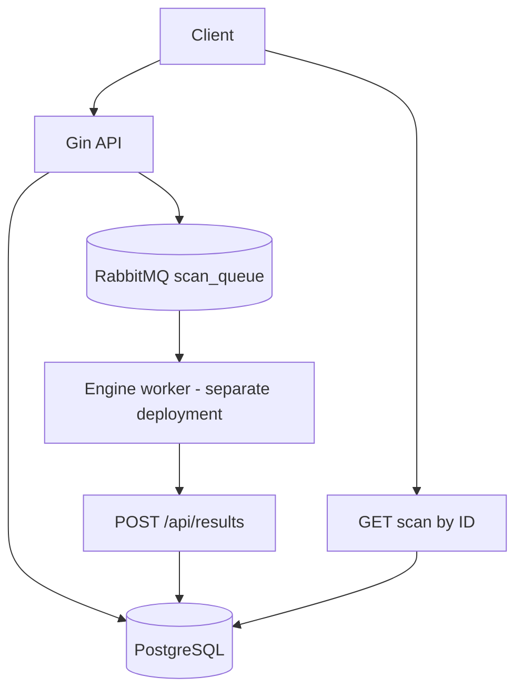

# ⚙️ Backend documentation

Backend-Antiginx is the HTTP orchestration layer for [engine-antiginx](https://github.com/prawo-i-piesc/engine-antiginx). Its entry point is `main.go`; it opens PostgreSQL and RabbitMQ connections, runs GORM migrations, declares broker topology and starts the Gin router on port `4000`.

## 🏗️ Request lifecycle

1. `POST /api/freescans` queues a public scan; `POST /api/scans` queues an authenticated user's scan with selected tests.
2. The backend saves a scan as `PENDING` and publishes a persistent JSON task to RabbitMQ. Free submissions use `main_exchange` / `scan_key`; premium submissions publish to the default exchange with routing key `scan_queue`.
3. An **external worker** consumes `scan_queue` and calls `POST /api/results` as tests run. Results move `PENDING` → `RUNNING`; a completion callback marks the scan `COMPLETED`.
4. Clients poll `GET /api/freescans/:id` (public) or `GET /api/scans/:id` (owner only) for status and results.

`main.go` declares a durable `scan_queue` with a dead-letter exchange `retry_exchange`, and a `wait_queue` with a 5-second TTL routed back to `main_exchange`. The backend itself does not consume messages or execute security tests.

## 📁 Source map

| Path | Responsibility |
| --- | --- |
| `main.go` | Startup, migrations, RabbitMQ topology and server |
| `internal/api/router.go` | Route groups, CORS and response security headers |
| `internal/config/config.go` | Required settings and defaults |
| `internal/handlers/scan_handler.go` | Scan submissions, worker callbacks, polling, dashboards |
| `internal/handlers/auth*_handler.go` | Registration, sessions, MFA, OAuth, passkeys, account operations |
| `internal/handlers/admin_handler.go` | Admin database and dashboard endpoints |
| `internal/models/` | Database models and JSON scan result types |
| `internal/auth/`, `middleware/` | Tokens, sessions, password policies, bearer and origin checks |

## 📚 Reference

- [Configuration](./Configuration.md) — environment, startup and deployment.
- [Scans and results](./Scans.md) — endpoints, queue payload and callback contract.
- [Authentication and account API](./Auth.md) — JWT, refresh sessions, MFA, OAuth, WebAuthn and admin routes.
- [Quick Start](../QuickStart/QuickStart.md) — local, Docker and Compose instructions.

!!! warning "Integration boundary"
    `POST /api/results` is public in the current router. It must not be exposed to untrusted callers without external controls (for example, a private network or gateway authorization). Scan target validation is limited to a required field; restrict who can submit scan targets when deploying this service.
